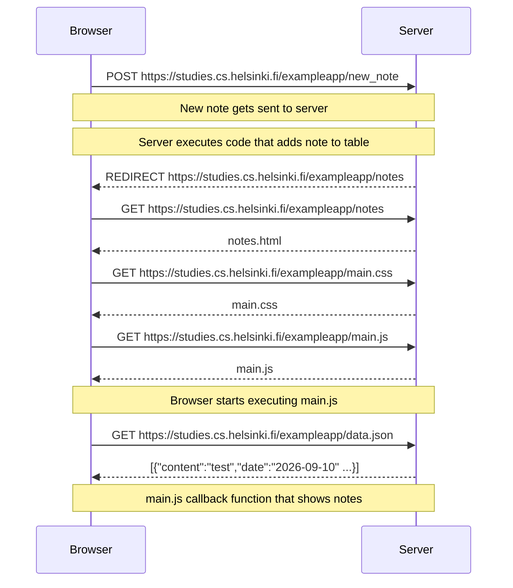

```mermaid
sequenceDiagram
Browser->>Server: POST https://studies.cs.helsinki.fi/exampleapp/new_note
Note over Browser,Server: New note gets sent to server
Note over Browser,Server: Server executes code that adds note to table
Server-->>Browser: REDIRECT https://studies.cs.helsinki.fi/exampleapp/notes
Browser->>Server: GET https://studies.cs.helsinki.fi/exampleapp/notes
Server-->>Browser: notes.html
Browser->>Server: GET https://studies.cs.helsinki.fi/exampleapp/main.css
Server-->>Browser: main.css
Browser->>Server: GET https://studies.cs.helsinki.fi/exampleapp/main.js
Server-->>Browser: main.js
Note over Browser,Server: Browser starts executing main.js
Browser->>Server: GET https://studies.cs.helsinki.fi/exampleapp/data.json
Server-->>Browser: [{"content":"test","date":"2026-09-10" ...}]
Note over Browser,Server: main.js callback function that shows notes
```
