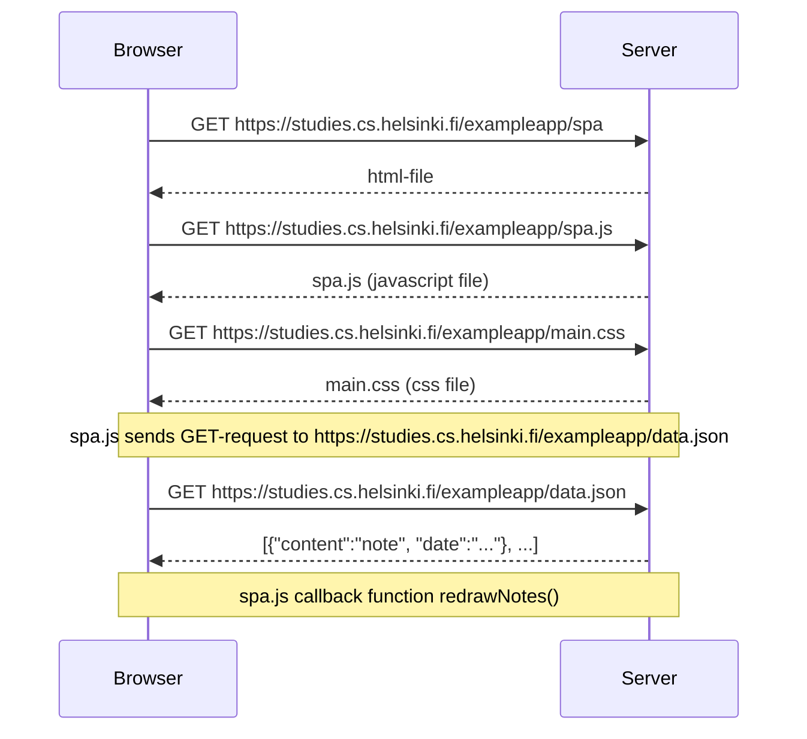

```mermaid
sequenceDiagram
Browser->>Server: GET https://studies.cs.helsinki.fi/exampleapp/spa
Server-->>Browser: html-file
Browser->>Server: GET https://studies.cs.helsinki.fi/exampleapp/spa.js
Server-->>Browser: spa.js (javascript file)
Browser->>Server: GET https://studies.cs.helsinki.fi/exampleapp/main.css
Server-->>Browser: main.css (css file)
Note over Browser,Server: spa.js sends GET-request to https://studies.cs.helsinki.fi/exampleapp/data.json
Browser->>Server: GET https://studies.cs.helsinki.fi/exampleapp/data.json
Server-->>Browser: [{"content":"note", "date":"..."}, ...]
Note over Browser,Server: spa.js callback function redrawNotes()
```
